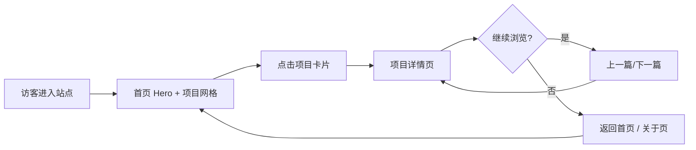
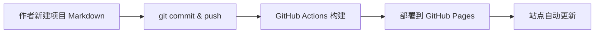

# PRD · ALLEN 个人作品集站点

## 1. 产品概述

为 ALLEN（GitHub: MORECORIANDERS）打造一个托管在 GitHub Pages 上的个人项目作品集站点，用于集中展示并持续沉淀个人项目。每个项目拥有独立的详情页，访客可从首页列表一键跳转。

- **核心目的**：以一座持续生长的「项目档案库」呈现个人作品，便于他人快速了解作者能力与品味，并为后续新增项目提供低成本的扩展方式。
- **目标用户**：潜在合作者、招聘方、技术同好、作者本人。
- **价值**：一处可分享的、有设计感的个人入口；新增项目只需新增一个 Markdown 文件即可上线，无需改动站点逻辑。

## 2. 核心功能

### 2.1 用户角色

| 角色 | 访问方式 | 权限 |
|------|----------|------|
| 访客 | 公开链接 | 浏览首页、项目列表、项目详情、关于页；切换昼夜主题 |
| 作者（ALLEN） | 本地编辑 + Git 推送 | 通过 Content Collection 新增/编辑项目 Markdown 文件，推送后自动构建部署 |

### 2.2 功能模块

1. **首页**：品牌 Hero、个人简介片段、精选项目网格、技能/技术栈条带、页脚联系区。
2. **项目详情页**：封面视觉、标题与元信息、项目概述、问题/方案/成果分段、图集、技术栈、外链（演示/源码）、上一篇/下一篇导航。
3. **关于页**：个人简介、技能矩阵、经历时间线、联系方式与外链。

### 2.3 页面明细

| 页面 | 模块 | 功能描述 |
|------|------|----------|
| 首页 | Hero 区 | 大字标题 + 副标语 + 动态氛围背景（渐变光晕/颗粒噪点）；首屏淡入上浮入场 |
| 首页 | 简介片段 | 一段精炼的自我介绍，配细分割线与年份等元数据 |
| 首页 | 精选项目网格 | 卡片式展示，含封面、标题、简述、标签；悬浮时图片微缩放 + 强调色描边线 + 标题位移；点击进入详情页 |
| 首页 | 技术栈条带 | 横向滚动的技术关键词，低调呈现能力面 |
| 首页 | 页脚 | 邮箱、GitHub 等外链 + 版权 |
| 项目详情页 | 封面区 | 大幅封面图，叠加项目标题/年份/角色/标签 |
| 项目详情页 | 正文 | 概述 → 问题 → 方案 → 成果 四段式叙事 |
| 项目详情页 | 图集 | 多图网格，点击可放大查看 |
| 项目详情页 | 技术栈 | 标签云形式列出所用技术 |
| 项目详情页 | 外链 | 「在线演示」「源码」按钮，指向外部链接 |
| 项目详情页 | 导航 | 上一篇/下一篇项目，形成连续浏览 |
| 关于页 | 简介 | 个人介绍长文 + 头像 |
| 关于页 | 技能矩阵 | 分类列出技能与熟练度 |
| 关于页 | 经历时间线 | 纵向时间线呈现重要节点 |
| 关于页 | 联系区 | 邮箱、GitHub、社交外链 |

## 3. 核心流程

**访客浏览流程**：进入首页 → 浏览 Hero 与精选项目 → 点击某项目卡片 → 进入项目详情页阅读 → 通过上一篇/下一篇继续浏览，或返回首页/前往关于页。

**作者发布流程**：本地新增 `src/content/projects/xxx.md`（填写 frontmatter 与正文）→ `git push` → GitHub Actions 自动构建并部署到 Pages → 站点更新。

## 4. 用户界面设计

### 4.1 设计风格

定位：**「编辑式奢华极简」**——大气、简约、高端、精致。大量留白、精致衬线标题、克制的强调色、细腻的纹理与动效。

- **主色 / 辅色**：
  - 白天：暖纸色底 `#F6F3EE`、近黑墨 `#1C1B19`、黄铜强调色 `#9A7B4F`、次要灰 `#6B655C`。
  - 黑夜：暖近黑底 `#121114`、暖白字 `#ECE7DE`、亮黄铜强调色 `#B89366`、次要灰 `#8A847A`。
- **按钮风格**：极简文字按钮 + 细底线 hover；主要 CTA 为黄铜色描边胶囊按钮，hover 时填充。
- **字体**：
  - 标题（中西文）：`Fraunces`（可变衬线，优雅）+ `Noto Serif SC`。
  - 正文（中西文）：`Manrope` + `Noto Sans SC`。
  - 等宽：`JetBrains Mono`（用于元数据/标签）。
- **布局风格**：桌面优先的宽幅布局，12 栏隐式网格，非对称留白，细发丝分割线，卡片式项目网格。
- **图标 / emoji**：不使用 emoji；使用极简线性 SVG 图标（昼夜/箭头/外链）。
- **纹理细节**：全站叠加极淡颗粒噪点 + 暖色渐变光晕，营造氛围与层次。

### 4.2 页面设计概览

| 页面 | 模块 | UI 元素（风格/布局/配色/字体/动效） |
|------|------|-------------------------------------|
| 首页 | Hero | 超大衬线标题 + 副标语；暖光晕渐变背景 + 噪点；入场淡入上浮，逐级 stagger |
| 首页 | 项目网格 | 非对称卡片网格；封面 + 黄铜描边 hover + 标题位移；hover 时图片 1.04 倍缩放 |
| 项目详情页 | 封面 | 全宽封面 + 暗色叠层 + 标题/元信息；滚动视差微移 |
| 项目详情页 | 正文 | 单栏长读排版，最大宽度 70ch；段落首字下沉可选 |
| 关于页 | 时间线 | 纵向发丝线 + 节点圆点；滚动逐项揭示 |
| 全局 | 主题切换 | 右上角日/月图标；切换时全站平滑过渡（颜色 transition） |

### 4.3 响应式

桌面优先（≥1024px 宽幅多栏），平板（768–1024px）双栏，移动端（<768px）单栏堆叠、汉堡菜单、触摸友好的点击区（≥44px）。字号使用 `clamp()` 流体缩放。

### 4.4 3D 场景

不适用（本项目为二维静态作品集，不引入 3D）。
