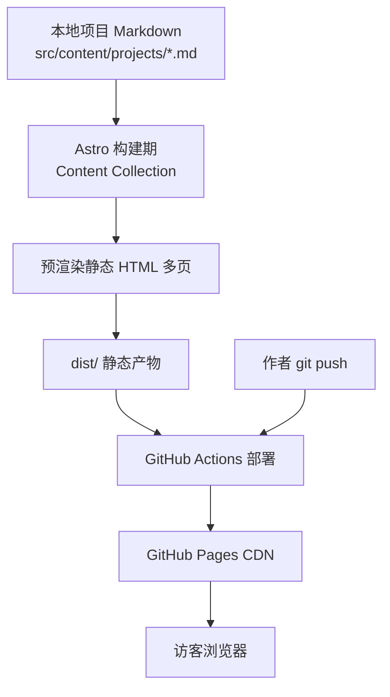
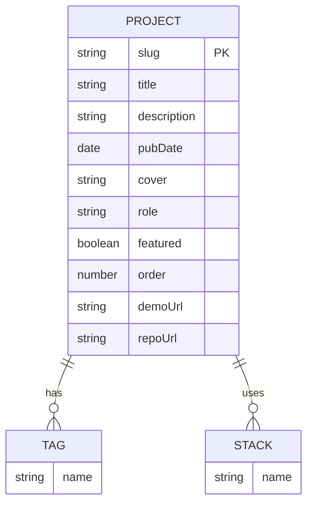

# 技术架构文档 · ALLEN 个人作品集站点

## 1. 架构设计

纯静态前端站点，无后端、无数据库。Astro 在构建时从 Content Collection（本地 Markdown）读取项目数据，预渲染为多页 HTML，由 GitHub Actions 自动构建并部署到 GitHub Pages。



## 2. 技术说明

- **前端框架**：Astro（最新稳定版，静态输出 `output: 'static'`）。理由：内容站点首选，构建产物小、加载快，文件式路由天然支持「每个项目一页」。
- **样式方案**：Astro 作用域 CSS + 全局 CSS 变量驱动主题切换（不引入 Tailwind，保持精致手写 CSS 的可控性）。如后续需要可平滑接入。
- **内容管理**：Astro Content Collections，`src/content/projects/` 下每个 `.md` 即一个项目；用 Zod schema 校验 frontmatter。
- **主题切换**：`<head>` 内联脚本在首屏前读取 `localStorage` 与系统偏好，设置 `<html data-theme="light|dark">`，避免闪烁（FOUC）；CSS 变量切换配色。
- **字体**：Google Fonts 引入 `Fraunces`、`Manrope`、`Noto Serif SC`、`Noto Sans SC`、`JetBrains Mono`，`<link rel="preconnect">` 优化加载。
- **部署**：GitHub Actions（官方 `actions/deploy-pages`），推送 `main` 分支即自动构建部署。
- **初始化工具**：`npm create astro@latest`（最小模板），随后手动加入 Content Collection、布局与页面。
- **后端 / 数据库**：无。所有数据为本地 Markdown 与站点配置。

## 3. 路由定义

Astro 文件式路由，部署于 `https://morecorianders.github.io/portfolio/`（`base = "/portfolio/"`）。

| 路由（文件） | URL | 用途 |
|--------------|-----|------|
| `src/pages/index.astro` | `/portfolio/` | 首页：Hero、简介、精选项目网格、技术栈、页脚 |
| `src/pages/projects/[slug].astro` | `/portfolio/projects/<slug>` | 项目详情页，由 Content Collection 静态生成多页 |
| `src/pages/about.astro` | `/portfolio/about` | 关于页：简介、技能、经历时间线、联系 |
| `src/pages/404.astro` | `/portfolio/404` | 自定义 404 |

## 4. API 定义

无后端 API。项目数据通过 Content Collection 在构建期读取：

```ts
// src/content/config.ts
import { defineCollection, z } from 'astro:content';

const projects = defineCollection({
  type: 'content',
  schema: z.object({
    title: z.string(),
    description: z.string(),
    pubDate: z.coerce.date(),
    updatedDate: z.coerce.date().optional(),
    cover: z.string(),            // 图片路径，置于 src/assets 或 public
    coverAlt: z.string(),
    role: z.string().optional(),
    tags: z.array(z.string()).default([]),
    stack: z.array(z.string()).default([]),
    demoUrl: z.string().url().optional(),
    repoUrl: z.string().url().optional(),
    featured: z.boolean().default(false),
    order: z.number().default(0),
  }),
});

export const collections = { projects };
```

## 5. 服务端架构

不适用（纯静态，无服务端）。

## 6. 数据模型

### 6.1 数据模型定义

项目实体为 Markdown 文件 + frontmatter，关系如下：



### 6.2 数据定义语言

不使用关系型数据库。项目「表」以文件目录形式存在：

```
src/content/projects/
├── aurora-dashboard.md      # 示例占位项目 1
├── tide-forecast-app.md     # 示例占位项目 2
└── inkwell-cms.md           # 示例占位项目 3
```

每个文件示例：

```markdown
---
title: "Aurora Dashboard"
description: "面向数据团队的高密度实时指标看板"
pubDate: 2025-03-12
cover: "/projects/aurora/cover.jpg"
coverAlt: "Aurora 看板封面"
role: "设计与全栈开发"
tags: ["数据可视化", "实时"]
stack: ["React", "D3", "WebSocket", "Node"]
demoUrl: "https://example.com"
repoUrl: "https://github.com/MORECORIANDERS/aurora"
featured: true
order: 1
---

## 概述
一段项目概述……

## 问题
……

## 方案
……

## 成果
……
```

新增项目 = 新增一个 `.md` 文件并 `git push`，无需改代码。
